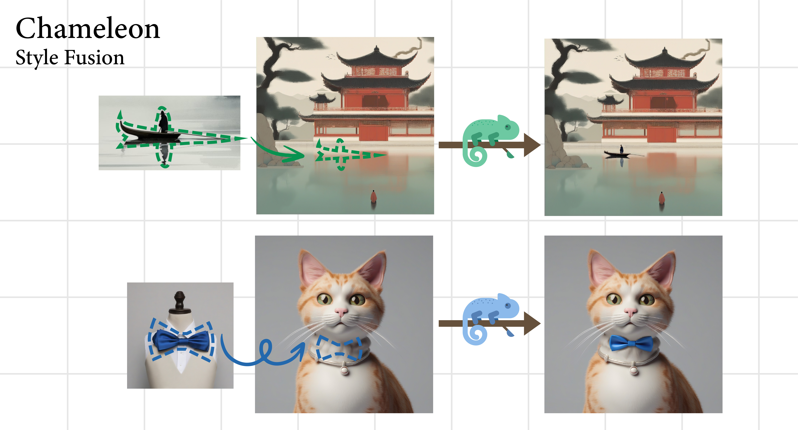
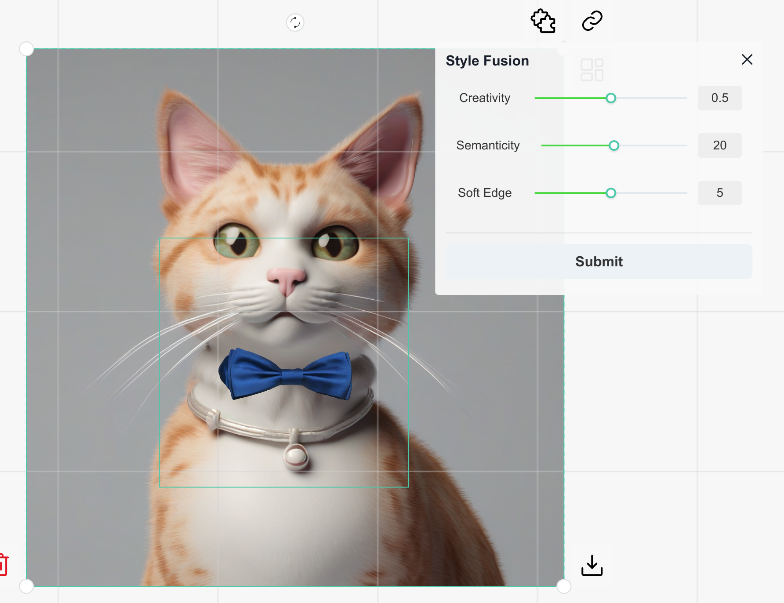

# Chameleon - AI Drawing Tool
Welcome to Chameleon, an AI drawing tool based on [TensorRT](https://github.com/NVIDIA/TensorRT) and [SDXL](https://github.com/Stability-AI/generative-models), featuring style fusion and fast inference. The UI component of this project is built on the [Carefree-drawboard](https://github.com/carefree0910/carefree-drawboard) framework, and we would like to express our gratitude for providing a simple and intuitive interaction experience.



## Features

1. Style Fusion: Chameleon can naturally blend objects with different styles, creating unique artistic compositions.
2. Fast Inference: Accelerated with [TensorRT](https://github.com/NVIDIA/TensorRT), Chameleon provides faster inference, allowing you to instantly preview generated effects.
3. Additional Features:
   - Text-to-Image: Transform text into captivating images.
   - Image-to-Image: Generate images based on existing visuals.
   - Inpainting: Restore or complete images seamlessly.
   - [ControlNet](https://huggingface.co/collections/diffusers/sdxl-controlnets-64f9c35846f3f06f5abe351f): Advanced control over generated content.
   - HighresFix: Enhance image resolution for finer details.
   - [DemoFusion](https://github.com/PRIS-CV/DemoFusion): Generate image at 4×, 16×, and even higher resolutions without any fine-tuning or prohibitive memory demands.
   - [Segment-Anything](https://github.com/facebookresearch/segment-anything): Segment and manipulate various elements in images.

## Getting Start

### 1. Prepare Environment

Install nvidia-docker using these [instructions](https://docs.nvidia.com/datacenter/cloud-native/container-toolkit/latest/install-guide.html), and then configure the container:

```bash
git clone https://github.com/yuhaoo00/Chameleon.git
docker run -it --gpus all --name sdtrt --network=host --ulimit memlock=-1 --ulimit stack=67108864 -v ./Chameleon:/work/Chameleon nvcr.io/nvidia/pytorch:23.10-py3 /bin/bash
```

After launching the docker, execute the following commands to install various dependencies: 
```bash
cd /work/Chameleon

# prepare python environment
pip install -r requirement.txt
pip uninstall transformer-engine

# install cfdraw
npm install --global yarn
cfdraw install
cfdraw init

# build trt plugins
cd src/utils_trt/plugins
mkdir build && cd build 
cmake .. && make -j5
```

### 2. Start Backend API
Launch the backend API to handle the core functionality. Execute the following command:
```bash
cd /work/Chameleon
python api.py
```
The first run may take around \~ 30 minutes to build the TRT engines. You can customize the engine configuration in the `apiconfig.py`.

### 3. Start Frontend UI
Initiate the frontend UI for a user-friendly experience. Run the following command:
```bash
cfdraw run
```

Open http://localhost:5123 in your browser to access the Chameleon application.



## Contribution
If you have any suggestions or discover any bugs, feel free to raise them in the Issues section.


